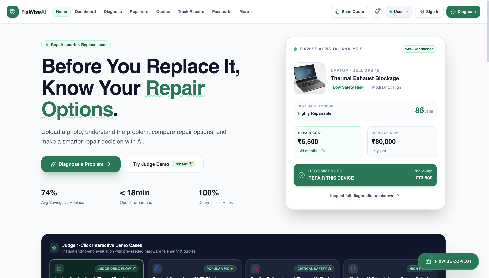
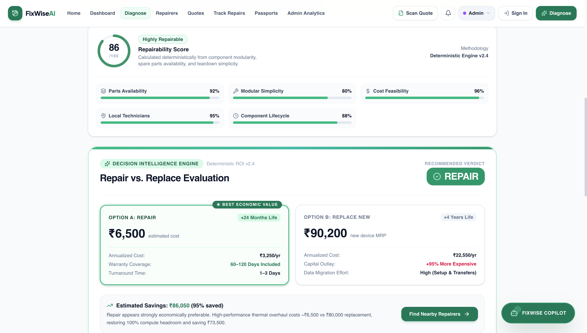
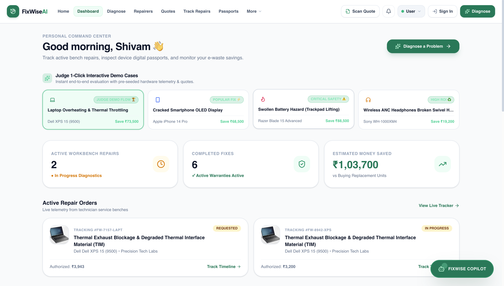
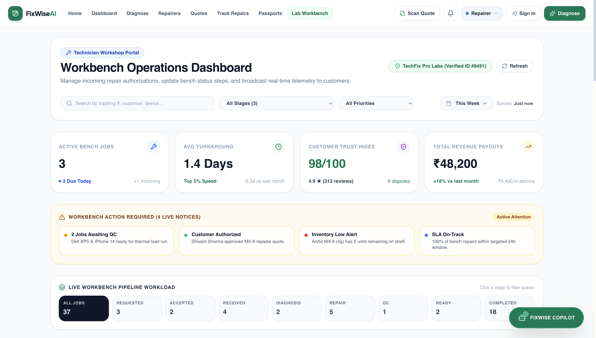
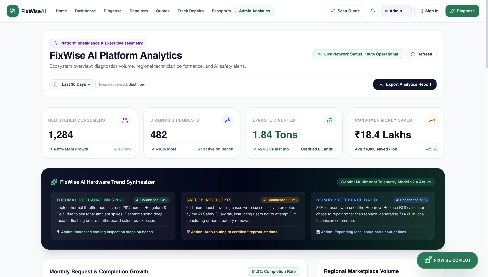
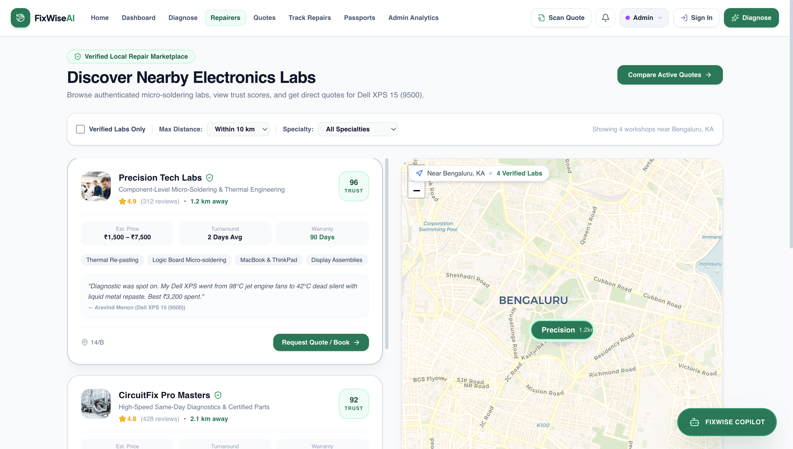
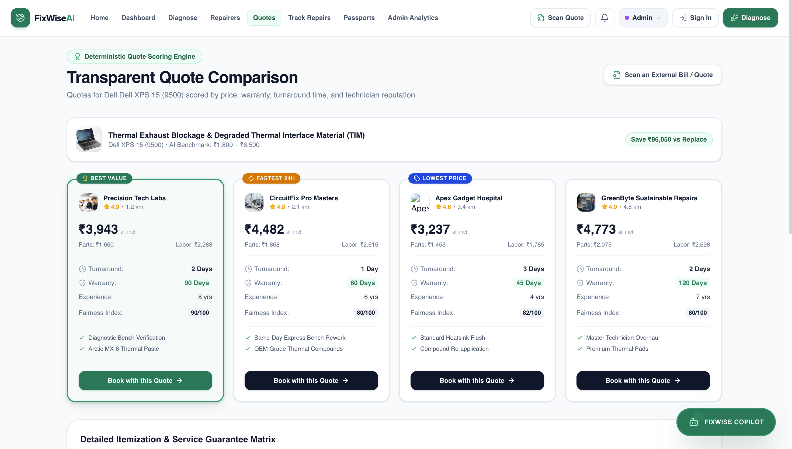
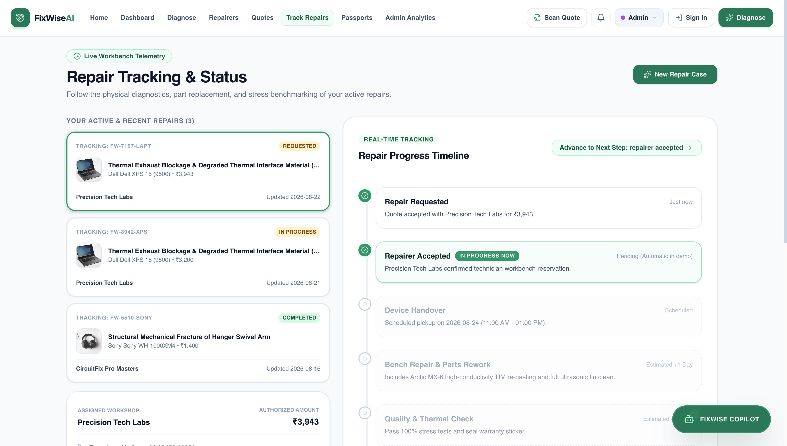
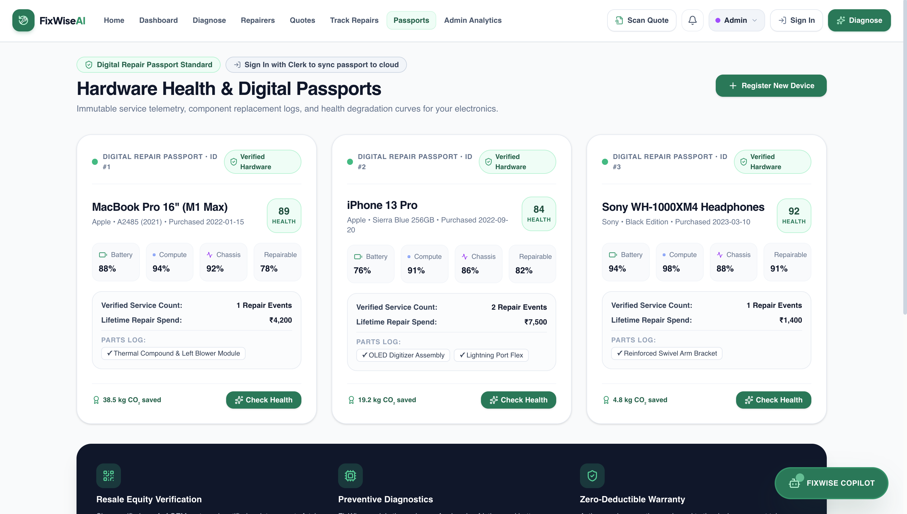
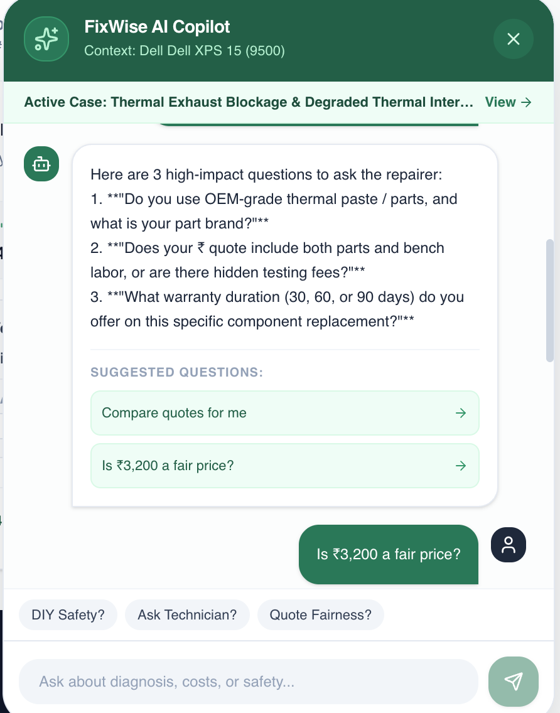

# 🔧 FixWise AI

### Repair smarter. Replace less.

<p align="center">
  <strong>AI-powered repair decision intelligence for broken devices.</strong>
</p>

<p align="center">
  Diagnose the problem. Understand the repair. Compare the cost. Make the right decision.
</p>

<p align="center">
  <a href="https://fixwise-ai-eight.vercel.app">Live Demo</a>
  &nbsp; • &nbsp;
  <a href="https://github.com/23-shivamsingh/FixWise">Source Code</a>
</p>

---

## 📸 Product Preview

<p align="center">
  
</p>

<p align="center">
  <em>AI-powered repair intelligence that helps users make smarter repair-or-replace decisions.</em>
</p>

---

# 💡 The Problem

When a device breaks, most people immediately ask:

> **"Should I repair it or replace it?"**

The difficult part is that users usually don't know:

- What exactly is wrong with the device
- Whether the issue is serious or easily repairable
- How much the repair should realistically cost
- Whether the repair is worth the device's remaining value
- How long the repair might take
- Whether a nearby repairer can handle the problem
- Whether replacing the device would actually be a better financial decision

This often leads to one of two outcomes:

**Overpaying for a repair** or **replacing a device that could have been repaired.**

FixWise AI is designed to make that decision easier.

---

# 🚀 What is FixWise AI?

**FixWise AI** is an AI-powered **Repair Decision Platform** that helps users move from:

> **Broken Device → Diagnosis → Repair Options → Cost Comparison → Decision**

Instead of acting like a simple image-diagnosis chatbot, FixWise combines AI analysis with repair intelligence, cost comparison, repairer discovery, quote management, repair tracking and device history.

The goal is simple:

> **Help people understand their repair options before spending money on a replacement.**

---

# 🎯 Core Idea

FixWise turns a device problem into an actionable repair decision.

```text
                 BROKEN DEVICE
                       │
                       ▼
              Upload / Describe
                 the problem
                       │
                       ▼
                AI DIAGNOSIS
                       │
          ┌────────────┼────────────┐
          ▼            ▼            ▼
       Problem       Risk       Repairability
       Analysis     Assessment    Assessment
          │            │            │
          └────────────┼────────────┘
                       ▼
               REPAIR OPTIONS
                       │
                       ▼
              COST COMPARISON
                       │
             ┌─────────┴─────────┐
             ▼                   ▼
         REPAIR              REPLACE
             │                   │
             └─────────┬─────────┘
                       ▼
                SMART DECISION
                       │
                       ▼
             TRACK THE REPAIR
````

---

# ✨ Key Features

## 1. 🤖 AI-Powered Visual Diagnosis

Users can provide an image of a damaged device and receive an AI-assisted analysis of the visible issue.

The system can help identify:

* Possible device problem
* Damage category
* Severity
* Safety considerations
* Repairability
* Recommended next steps

The objective is not just to say **"this device is damaged"**, but to turn the diagnosis into a useful decision.

---

## 2. ⚖️ Repair vs Replace Decision

FixWise focuses on the decision that matters most:

> **Is repairing this device actually worth it?**

The platform compares factors such as:

* Estimated repair cost
* Replacement cost
* Expected additional device life
* Repairability
* Safety considerations
* Potential savings

This gives users a clearer picture before they spend money.

---

## 3. 💰 Repair Cost Intelligence

Instead of looking at a repair estimate in isolation, FixWise puts it into context.

Example:

```text
Repair Cost        ₹6,500

Replacement Cost   ₹80,000

Potential Saving   ₹73,500

Expected Added
Device Life       +24 months
```

This makes the financial trade-off easier to understand.

---

## 4. 🧰 Repairability Assessment

Not every damaged device should be repaired.

FixWise evaluates repairability and presents it as a decision factor.

Example:

```text
Repairability Score
        │
        ▼
     86 / 100
        │
        ├── High repairability
        ├── Lower replacement pressure
        └── Repair recommended
```

---

## 5. 🏪 Repairer Discovery

Users can explore repairer options instead of searching manually across multiple platforms.

The Repairers section is designed to connect the diagnosed problem with suitable repair services.

---

## 6. 🧾 Quote Comparison

Repair quotes can be compared before choosing a repair option.

This helps users evaluate:

* Price
* Repair option
* Expected turnaround
* Repairer
* Overall value

The goal is to reduce uncertainty before approving a repair.

---

## 7. 📍 Repair Tracking

After selecting a repair option, FixWise provides a dedicated repair-tracking experience.

A typical flow can be represented as:

```text
Request Created
      │
      ▼
Quote Received
      │
      ▼
Repair Approved
      │
      ▼
Device Received
      │
      ▼
Repair In Progress
      │
      ▼
Quality Check
      │
      ▼
Ready for Pickup
      │
      ▼
Completed
```

---

## 8. 🪪 Device Passport

FixWise can maintain a digital history for a device.

A device passport can become a long-term record containing information such as:

* Device identity
* Previous repairs
* Repair history
* Service information
* Diagnostic records
* Important device events

This transforms a one-time repair experience into a reusable device history.

---

## 9. 🧠 FixWise Copilot

The FixWise Copilot acts as an interactive assistant throughout the repair journey.

Instead of forcing users to understand technical terminology, the Copilot can help explain:

* What the diagnosis means
* What a repair involves
* Why a repair may be recommended
* What questions to ask a repairer
* How to interpret a quote
* What to consider before replacing a device

---

# 🏆 Judge Demo / Interactive Cases

FixWise includes a **Judge 1-Click Interactive Demo** experience.

This makes it possible to demonstrate the platform without requiring a complete real-world repair workflow during a presentation.

Example demo categories can include:

```text
┌─────────────────────┐
│   Popular Fix       │
│                     │
│   Device Problem    │
│         ↓           │
│   AI Diagnosis      │
│         ↓           │
│   Repair Decision   │
└─────────────────────┘

┌─────────────────────┐
│ Critical Safety     │
│                     │
│ Damage Assessment   │
│         ↓           │
│ Safety Evaluation  │
│         ↓           │
│ Recommended Action │
└─────────────────────┘
```

This allows judges to quickly understand the complete product flow.

---

# 📸 Platform Screenshots

## 🏠 Homepage

<p align="center">
  
</p>

---

## 🔍 AI Diagnosis

<p align="center">
  
</p>

---

## 📊 Dashboard

<p align="center">
  
</p>

<p align="center">
  
</p>

<p align="center">
  
</p>

---

## 🏪 Repairers

<p align="center">
  
</p>

---

## 🧾 Repair Quotes

<p align="center">
  
</p>


---

## 🚚 Track Repairs

<p align="center">
  
</p>


---

## 🪪 Device Passport

<p align="center">
  
</p>

---

## 🤖 FixWise Copilot

<p align="center">
  
</p>

> 📌 Replace `docs/screenshots/copilot.png` with your actual screenshot path.

---

# 🧠 How the AI Decision Layer Works

FixWise uses AI as one component of a larger decision-support system.

```text
              USER INPUT
                  │
                  ▼
          Device Image / Data
                  │
                  ▼
        ┌────────────────────┐
        │   AI ANALYSIS      │
        │                    │
        │ Problem Detection  │
        │ Damage Assessment  │
        │ Context Analysis   │
        └─────────┬──────────┘
                  │
                  ▼
        ┌────────────────────┐
        │ Decision Layer     │
        │                    │
        │ Repairability      │
        │ Cost Comparison    │
        │ Safety             │
        │ Device Value       │
        └─────────┬──────────┘
                  │
                  ▼
        ┌────────────────────┐
        │ Recommendation     │
        │                    │
        │ REPAIR / REPLACE   │
        └─────────┬──────────┘
                  │
                  ▼
        User takes action
```

The AI layer provides analysis, while the application combines that information with structured decision factors to produce a more useful outcome.

---

# 🏗️ System Architecture

```text
                         ┌──────────────────┐
                         │      User        │
                         └────────┬─────────┘
                                  │
                                  ▼
                         ┌──────────────────┐
                         │  React Frontend  │
                         │                  │
                         │ Dashboard        │
                         │ Diagnosis        │
                         │ Repairers        │
                         │ Quotes           │
                         │ Tracking         │
                         │ Passport         │
                         └────────┬─────────┘
                                  │
                                  ▼
                         ┌──────────────────┐
                         │ Express API      │
                         │                  │
                         │ Business Logic   │
                         │ Authentication   │
                         │ Data Operations  │
                         └───────┬──────────┘
                                 │
                  ┌──────────────┼──────────────┐
                  ▼              ▼              ▼
          ┌─────────────┐ ┌─────────────┐ ┌──────────────┐
          │ Gemini AI   │ │ PostgreSQL  │ │    Clerk     │
          │             │ │ + Prisma    │ │              │
          │ Diagnosis   │ │             │ │ Auth / User  │
          │ Analysis    │ │ Application │ │ Management   │
          └─────────────┘ │ Data        │ └──────────────┘
                          └─────────────┘
```

---

# 🛠️ Technology Stack

| Layer            | Technology        |
| ---------------- | ----------------- |
| Frontend         | React             |
| Build Tool       | Vite              |
| Styling          | Tailwind CSS      |
| UI Icons         | Lucide React      |
| Animations       | Motion            |
| Charts           | Recharts          |
| Maps             | Leaflet           |
| Backend          | Node.js + Express |
| Database         | PostgreSQL        |
| ORM              | Prisma            |
| Authentication   | Clerk             |
| AI               | Google Gemini API |
| Database Hosting | Neon PostgreSQL   |
| Deployment       | Vercel            |
| Version Control  | Git + GitHub      |

---

# 🔐 Authentication & Data

FixWise uses authentication to provide a personalized application experience.

Authentication and user management are handled using **Clerk**.

Application data is stored using **PostgreSQL**, with **Prisma** providing the database access layer.

The application architecture separates:

```text
Authentication
      │
      ▼
User Identity
      │
      ▼
Application Data
      │
      ▼
Repair / Device Records
```

---

# 🗄️ Database Architecture

The application uses PostgreSQL for structured application data.

Prisma acts as the ORM between the application and database.

Conceptually:

```text
React
  │
  ▼
Express API
  │
  ▼
Prisma
  │
  ▼
PostgreSQL
  │
  ├── Users
  ├── Devices
  ├── Diagnoses
  ├── Repairs
  ├── Quotes
  ├── Repairers
  └── Device History
```

> The exact database entities may evolve as the platform develops.

---

# 🔄 Complete User Journey

```text
┌─────────────────────┐
│       START         │
└──────────┬──────────┘
           │
           ▼
┌─────────────────────┐
│ Select / Add Device │
└──────────┬──────────┘
           │
           ▼
┌─────────────────────┐
│ Describe / Upload   │
│ Device Problem      │
└──────────┬──────────┘
           │
           ▼
┌─────────────────────┐
│    AI Diagnosis     │
└──────────┬──────────┘
           │
           ▼
┌─────────────────────┐
│ Repairability +     │
│ Risk Assessment     │
└──────────┬──────────┘
           │
           ▼
┌─────────────────────┐
│ Repair vs Replace   │
│ Cost Comparison     │
└──────────┬──────────┘
           │
           ▼
      ┌────┴────┐
      │         │
      ▼         ▼
   REPAIR    REPLACE
      │
      ▼
┌─────────────────────┐
│ Find Repairer       │
└──────────┬──────────┘
           │
           ▼
┌─────────────────────┐
│ Compare Quotes      │
└──────────┬──────────┘
           │
           ▼
┌─────────────────────┐
│ Approve Repair      │
└──────────┬──────────┘
           │
           ▼
┌─────────────────────┐
│ Track Repair        │
└──────────┬──────────┘
           │
           ▼
┌─────────────────────┐
│ Update Device       │
│ Passport / History  │
└─────────────────────┘
```

---

# 🎯 Why FixWise is Different

Most repair platforms focus on **finding a repair service**.

FixWise focuses first on **making the repair decision**.

### Traditional approach

```text
Device breaks
     ↓
Search Google
     ↓
Find repair shop
     ↓
Get quote
     ↓
Decide
```

### FixWise approach

```text
Device breaks
     ↓
AI-assisted diagnosis
     ↓
Understand the problem
     ↓
Assess repairability
     ↓
Compare repair vs replacement
     ↓
Find repair options
     ↓
Compare quotes
     ↓
Track repair
     ↓
Maintain device history
```

The platform is therefore designed around the **decision**, not just the transaction.

---

# 🌱 Sustainability Angle

Repairing a device instead of unnecessarily replacing it can extend its useful life.

FixWise supports a more repair-first mindset by helping users understand whether an existing device is still worth saving.

```text
Broken Device
      │
      ▼
Can it be repaired?
      │
      ▼
Is repair economically sensible?
      │
      ├───────────────┐
      ▼               ▼
    REPAIR          REPLACE
      │
      ▼
Extend useful
device lifetime
```

This connects the product with broader goals around:

* Product longevity
* Responsible consumption
* Reduced unnecessary replacement
* Repair accessibility
* Better consumer decisions

---

# 📦 Project Structure

```text
FixWise/
│
├── docs/
│   └── screenshots/
│       ├── homepage.png
│       ├── diagnose.png
│       ├── dashboard.png
│       ├── repairers.png
│       ├── quotes.png
│       ├── track-repairs.png
│       ├── passport.png
│       └── copilot.png
│
├── prisma/
│   ├── schema.prisma
│   └── seed.ts
│
├── public/
│
├── server/
│   └── server.ts
│
├── src/
│   ├── components/
│   ├── pages/
│   ├── services/
│   └── ...
│
├── .env
├── package.json
├── vite.config.ts
├── tsconfig.json
└── README.md
```

---

# ⚙️ Getting Started

## Prerequisites

Make sure you have the following installed:

* Node.js
* npm
* Git
* PostgreSQL / Neon database
* Clerk account
* Google Gemini API access

---

## 1. Clone the repository

```bash
git clone https://github.com/23-shivamsingh/FixWise.git
```

Move into the project:

```bash
cd FixWise
```

---

## 2. Install dependencies

```bash
npm install
```

---

# 🔑 Environment Variables

Create a `.env` file in the project root.

Example:

```env
GEMINI_API_KEY=your_gemini_api_key

DATABASE_URL=your_postgresql_connection_string

VITE_CLERK_PUBLISHABLE_KEY=your_clerk_publishable_key

CLERK_SECRET_KEY=your_clerk_secret_key
```

### Important

Never commit your actual `.env` file to GitHub.

Make sure `.env` is included in `.gitignore`.

For example:

```gitignore
.env
.env.local
.env.production
```

---

# 🗃️ Database Setup

Generate the Prisma client:

```bash
npm run db:generate
```

For local development migrations:

```bash
npm run db:migrate
```

If your project contains seed data:

```bash
npm run db:seed
```

---

# ▶️ Run the Application

Start the development server:

```bash
npm run dev
```

The application will be available locally at:

```text
http://localhost:3000
```

---

# 🏭 Production Build

Create a production build:

```bash
npm run build
```

Preview the production build locally:

```bash
npm run preview
```

---

# ☁️ Deployment

FixWise is designed to be deployed using Vercel.

The deployment flow is:

```text
GitHub Repository
       │
       ▼
     Vercel
       │
       ├── Install Dependencies
       │
       ├── Build Application
       │
       ├── Inject Environment Variables
       │
       ▼
   Production App
```

### Vercel Environment Variables

Add the required variables under:

```text
Vercel
→ Project
→ Settings
→ Environment Variables
```

Recommended environments:

```text
Production
Preview
```

Keep secret values such as:

```text
GEMINI_API_KEY
DATABASE_URL
CLERK_SECRET_KEY
```

server-side and never expose them in frontend code.

---

# 🧪 Demo Flow for Judges

For a quick hackathon demonstration:

### Step 1 — Open the Homepage

Show the main value proposition:

> **Before You Replace It, Know Your Repair Options.**

### Step 2 — Start Diagnosis

Upload or select a device problem.

### Step 3 — Show AI Analysis

Explain:

* Identified issue
* Confidence
* Risk
* Repairability

### Step 4 — Show the Decision

Highlight:

```text
Repair Cost
      vs
Replacement Cost
```

Then show the recommended action.

### Step 5 — Explore Repair Options

Navigate to:

```text
Repairers → Quotes
```

### Step 6 — Track the Repair

Show how the repair moves through its lifecycle.

### Step 7 — Show Device Passport

Finish by showing how the repair becomes part of the device's long-term history.

This demonstrates that FixWise is more than a diagnosis tool — it is a complete repair decision workflow.

---

# 📈 Future Roadmap

FixWise can evolve beyond the current platform into a larger repair intelligence ecosystem.

## Phase 1 — Current Platform

```text
AI Diagnosis
      ↓
Repairability
      ↓
Cost Comparison
      ↓
Repairer Discovery
      ↓
Quotes
      ↓
Repair Tracking
      ↓
Device Passport
```

## Phase 2 — Predictive Repair Intelligence

```text
Historical Repair Data
        ↓
Failure Patterns
        ↓
Predictive Maintenance
        ↓
Early Warnings
```

## Phase 3 — Connected Repair Ecosystem

Potential integrations include:

* IoT device telemetry
* Manufacturer service data
* Repairer networks
* Spare-part availability
* Dynamic repair pricing
* Warranty information

## Long-Term Vision

```text
                    FIXWISE
                       │
       ┌───────────────┼────────────────┐
       ▼               ▼                ▼
   Consumers       Repairers       Manufacturers
       │               │                │
       └───────────────┼────────────────┘
                       ▼
              Repair Intelligence
                       │
                       ▼
             Better Repair Decisions
```

---

# 🔭 Vision

The long-term goal of FixWise is to make repair decisions as easy and transparent as buying a new device.

Instead of:

> **"My device is broken. What should I do?"**

the user should be able to ask:

> **"Here is my device and its problem. Show me the smartest option."**

That is the problem FixWise is built to solve.

---

# 🏁 Hackathon Summary

### Problem

Consumers often lack the technical and financial information needed to decide whether a broken device should be repaired or replaced.

### Solution

FixWise AI combines AI-assisted diagnosis, repairability analysis, cost comparison and repair workflow management into a single platform.

### Innovation

The platform shifts the focus from:

**"Where can I repair my device?"**

to:

**"What is the smartest decision for my device?"**

### Impact

FixWise aims to:

* Reduce unnecessary device replacement
* Make repair decisions easier
* Improve repair transparency
* Help users compare repair options
* Extend useful device lifetimes
* Build a reusable digital repair history

---

# 👨‍💻 Built With

<p align="center">

**React** • **Vite** • **Tailwind CSS** • **Node.js** • **Express** • **PostgreSQL** • **Prisma** • **Clerk** • **Google Gemini** • **Vercel**

</p>

---

## 👤 Team

### Mantrayle

**Built independently by Shivam Singh**

Mantrayle is an independently built project focused on making repair decisions **smarter, more transparent, and more sustainable**.

FixWise AI brings together:

**AI Diagnosis · Repair Intelligence · Cost Analysis · Decision Support · Sustainability**

From identifying potential device issues to comparing repair and replacement costs, FixWise AI is designed as an end-to-end **Repair Decision Intelligence** platform.

> **Built solo. Designed to solve a real-world problem.**

---

## 📄 License

This project is provided for demonstration and educational purposes.

All rights reserved unless otherwise specified by the project authors.

---

<p align="center">

# 🔧 FixWise AI

**Repair smarter. Replace less.**

</p>

<p align="center">
  <em>Make the repair decision before making the replacement.</em>
</p>